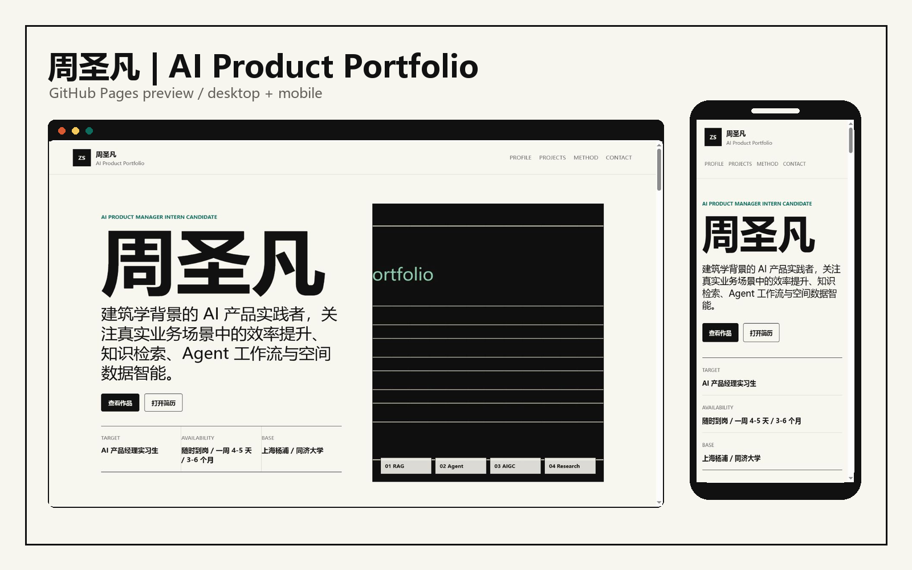

# 周圣凡 AI Product Portfolio

个人 AI 产品作品集静态网站，可直接部署到 GitHub Pages。

作品集链接：https://15079902633-sys.github.io/ai-product-portfolio/

## 部署方式

1. 新建 GitHub 仓库，例如 `ai-product-portfolio`。
2. 上传本目录中的 `index.html`、`styles.css`、`script.js`、`.nojekyll`、`README.md` 和 `assets/` 文件夹。
3. 在仓库 `Settings -> Pages` 中选择 `Deploy from a branch`，分支选择 `main`，目录选择 `/root`。
4. 保存后等待 GitHub Pages 构建完成。

## FormSubmit

联系区的需求工单使用 FormSubmit 免费服务：

`https://formsubmit.co/15079902633@163.com`

首次提交表单后，需要在该邮箱中确认 FormSubmit 激活邮件，确认后表单才会正式转发。

## 链接预览

网站已配置 `favicon.ico`、`assets/favicon.png` 和 `assets/link-preview.jpg`，用于浏览器标签页图标和社交/聊天链接卡片预览。

当前已将 `index.html` 中的 `canonical`、`og:url`、`og:image` 和 `twitter:image` 更新为正式 GitHub Pages 地址。
